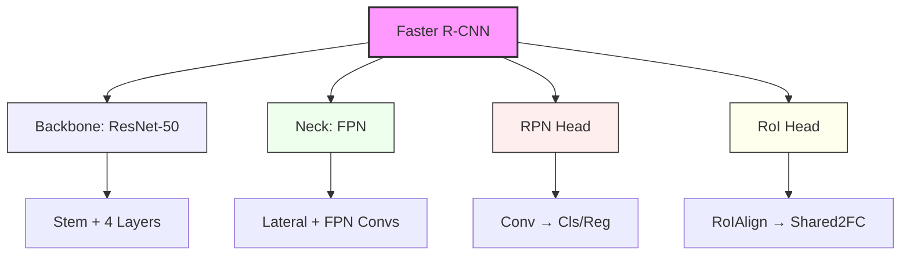

# FloorPlan Detection (Walls & Rooms)

Данный репозиторий содержит код для детекции стен и комнат на архитектурных поэтажных планах с использованием [MMDetection](https://github.com/open-mmlab/mmdetection).

Результаты работы можно увидеть в папках testing [https://github.com/Eltralo/Room-detection/tree/main/testing]  и results [https://github.com/Eltralo/Room-detection/tree/main/results] 

Базовый ридми включает:
- конфигурацию модели на базе **Faster R-CNN + ResNet-50 + FPN** Также можно посмотрть в floorplan_detector_base.py.
- анализ слабых мест;
- рекомендации по расширению модели (двери/окна) и по обработке текстовых размеров (OCR).

> Датасет и веса модели **не входят** в репозиторий.  

## для данной модели представлены классы wall и room. Предполагается дальнейшее дообучение на двери и окна и доработку размеров посредством OCR.

## Архитектура модели

## Почему выбрана эта архитектура

* Баланс точности и сложности

* Faster R-CNN надёжно локализует объекты и хорошо работает с тонкими и сложными структурами (стены, перегородки), что критично для планов.

**ResNet-50**

-Достаточно глубокая сеть для сложных планов с множеством элементов.
-FPN (Feature Pyramid Network)
Поскольку стены и комнаты бывают разного масштаба. FPN:
* объединяет признаки с разных уровней;
* помогает корректно детектировать и мелкие, и крупные объекты.

Для двух классов wall и room: 

* можно восстановить топологию помещений;
* поверх этого уже строить более богатую семантику (двери, окна, площади и т.п.).
* Совместимость с MMDetection

*Используется стандартный стек MMDetection 3.x + MMEngine + MMCV. Легко заменить бэкбон или детектор (на Cascade R-CNN, Swin, RetinaNet и др.).*

## Слабые места

1. Только два класса
2. Двери, окна, мебель и прочие объекты не детектируются;
3. Для этого нужно расширить датасет и увеличить количество классов.
4. Для точной геометрии (маски стен/комнат) может потребоваться Mask R-CNN или отдельный сегментационный пайплайн.
5. Нет обработки текста/размеров
6. Числовые размеры и подписи на чертеже не обрабатываются; Для этого нужен отдельный OCR-пайплайн (см. раздел ниже).
9. Чувствительность к стилю планов
10. Толщина линий, стиль отрисовки, наличие текстур/заливок могут влиять на качество;
11. Необходима адаптация/дообучение под конкретный домен.

## OCR для размеров и текстов.

**Рекомендуемый подход:**

* Предобработка изображения
* Повышение контраста, удаление цветных заливок, при необходимости бинаризация.
* Нормализация разрешения (слишком мелкий текст плохо читается).
* Поиск текстовых регионов

